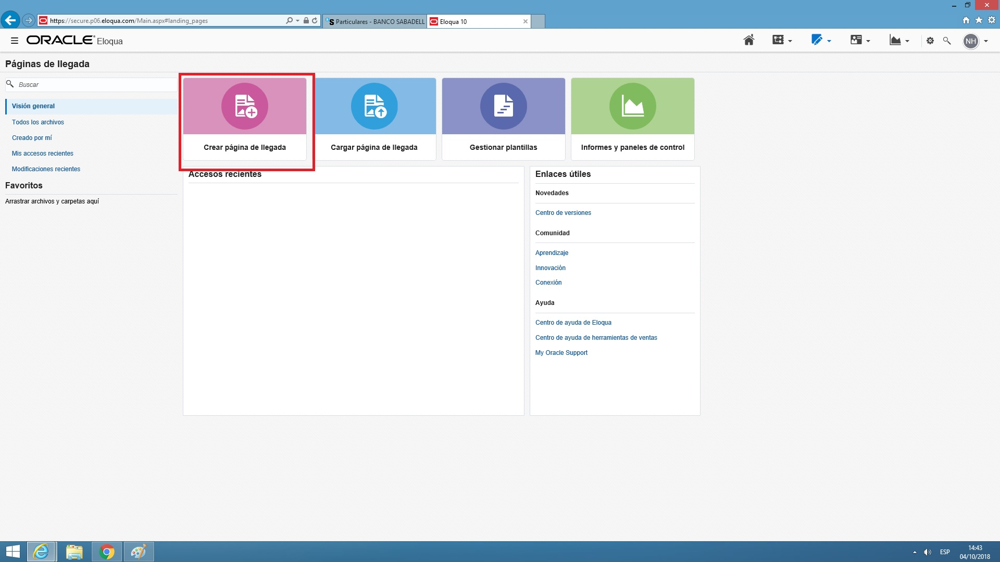
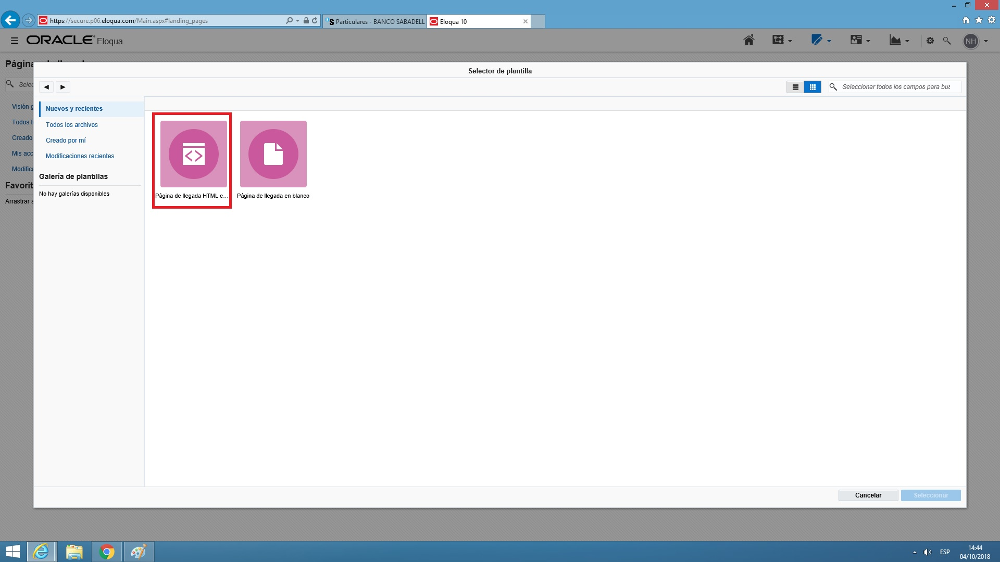
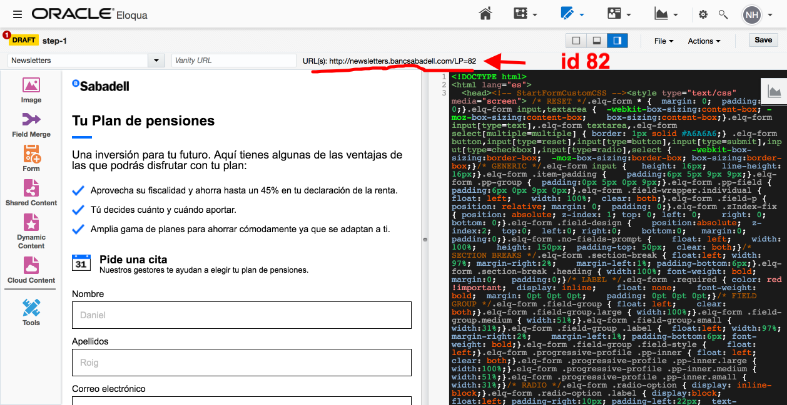
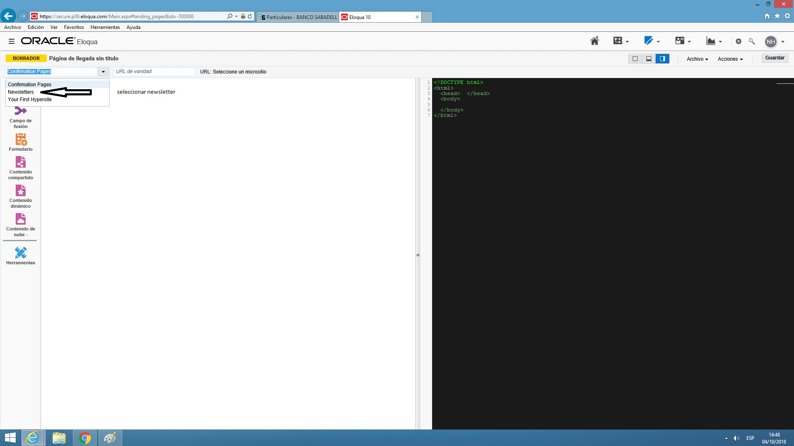
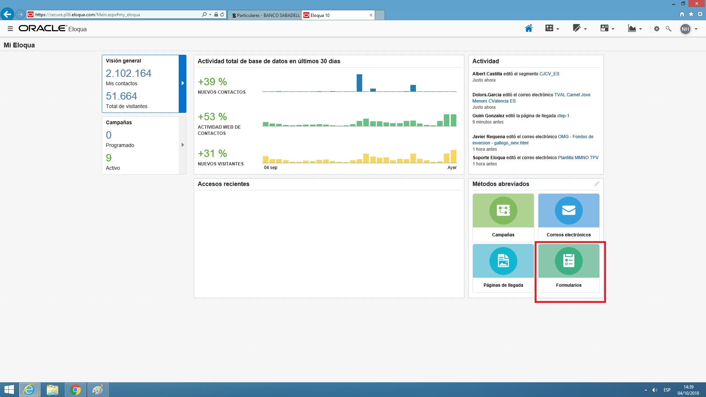
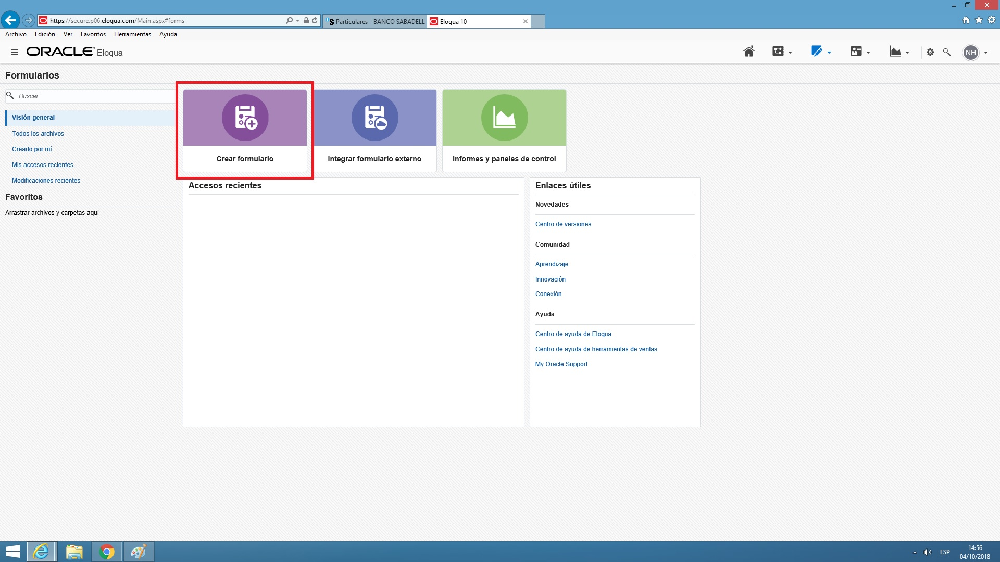
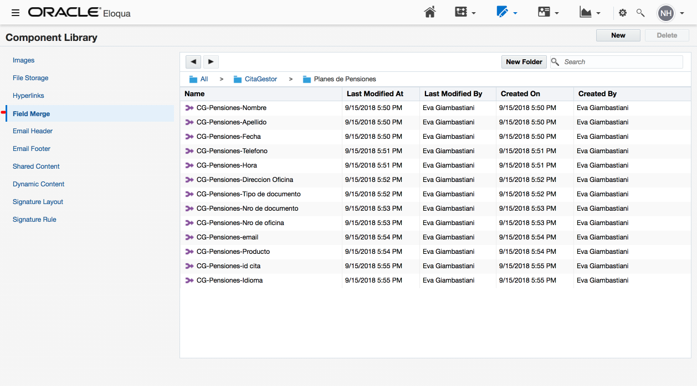
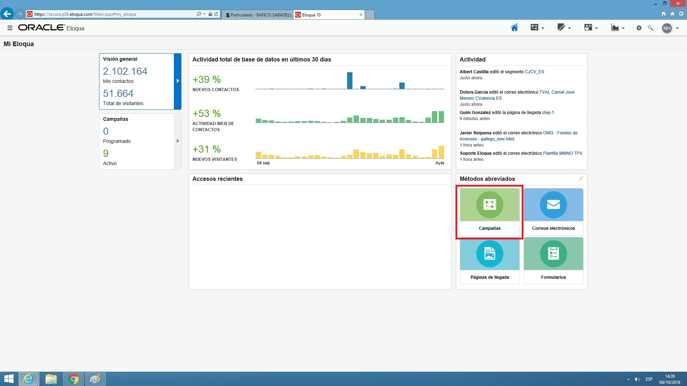
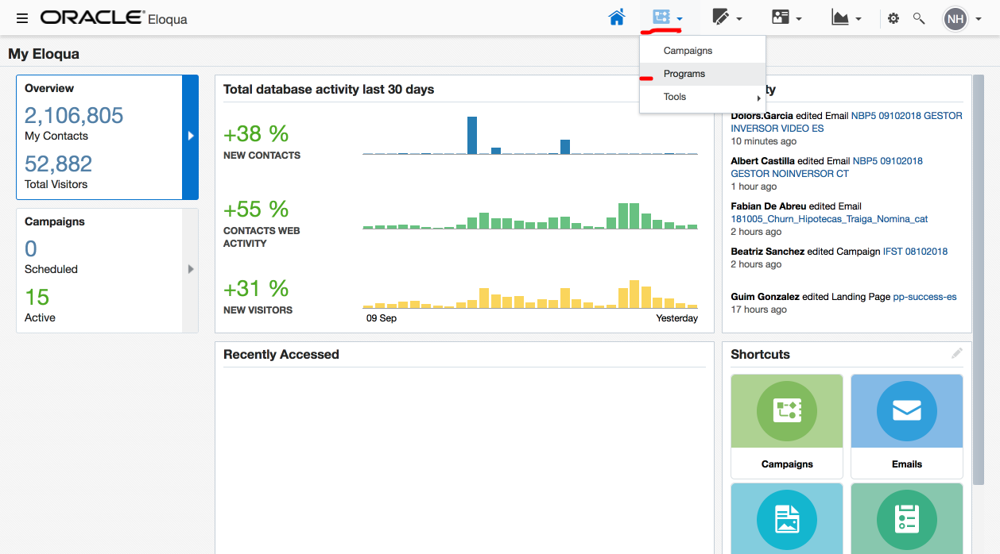
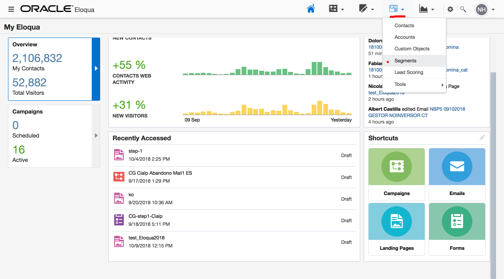

# Implementación Citas Gestor Banc Sabadell en Eloqua

## Introducción

En esta documentación se describen los pasos para, por una parte, integrar en Eloqua las plantillas y assets asociados a las landings que se entregan desde BeRepublic y que forman una parte de todo el flujo de Cita Gestor. Y por otra parte la configuración de todo el flujo destinado a recoger y recuperar leads desde los pasos de registro a todas las campañas de mailings asociadas a E-mail Marketing.

## Proyecto

Para realizar esta migración se tuvieron 3 puntos en cuenta:

1. Mejorar el UX & UI actuales
2. Evolucionar el flujo de E-mail Marketing
3. Agilizar el proceso de producción de una landing page

   Actualmente existen dos maneras de migrar los citas. Por un lado, añadirlas a Eloqua

   \(integración explicada más adelante\) y por el otro alojarlas en otro servidor y realizar las

   conexiones necesarias.

### El flujo consiste en:

* **Happy Pass:** El usuario ingresa a una landing Step 1, completa y envía el nombre, apellido y correo electrónico para pasar al Step 2. En el Step 2 completa y envía los datos, se redirecciona a una landing de éxito y recibe un email de confirmación de cita. El usuario confirma y se redirecciona a una landing de confirmación. En ese momento recibe un recordatorio de cita automáticamente en su correo. Oficina y gestor de oficina reciben un email con los datos de la cita confirmada por el usuario. 24hs antes de la cita, el usuario recibe un email de recordatorio.
* **Campaña de Abandono:** El usuario ingresa a una landing Step 1, completa y envía el nombre, apellido y correo electrónico para pasar al Step 2. En el Step 2 no completa y entra en la campaña de abandono, en la cuál recibe 3 emails a las 4hs, 24hs y 48hs. Estos emails redireccionan al Step 2 para acabar de completar y enviar los datos.
* **Campaña de Recuperación:** El usuario ingresa a una landing Step 1, completa y envía el nombre, apellido y correo electrónico para pasar al Step 2. En el Step 2 completa y envía los datos, se redirecciona a una landing de éxito y recibe un email de confirmación de cita. El usuario no confirma

  y entra en la campaña de recuperación, en la cuál recibe 2 correos a las 4hs y 24hs. Estos emails contienen un "Blind Form" que agrega una “Y” en el CO en el momento que el usuario confirma. Se redirecciona a una landing de confirmación.

* **Campaña de Modificación:** Esta no es una campaña propiamente dicha. Consiste en que cada email de confirmación de cita tiene un link que permite modificar la fecha y hora de la cita en la landing de modificación de cita. Si el usuario modifica la cita, automáticamente recibe el email de confirmación y entra en el la campaña de recuperación.

### Estructura de configuración Cita Gestor en Eloqua:

* 6 Landings \(por idioma\)
  * step-1
  * step-2
  * success
  * error
  * modify
  * confirmation
* 9 Emails \(por idioma\)
  * email\_confirmar
  * email\_confirmada
  * email\_confirmada\_recordatorio
  * email\_abandono\_4hs
  * email\_abandono\_24hs
  * email\_abandono\_48hs
  * email\_confirmada\_recordatorio\_no\_confirmada\_4hs
  * email\_confirmada\_recordatorio\_no\_confirmada\_24hs
  * email\_oficina
* 6 Campañas \(por idioma\)
  * 1 de abandono, subdividida en 3
  * 1 de recuperación de la confirmación, subdividida en 2
  * 1 de recordatorio de cita para el usuario
* 1 Custom Object \(comparte idioma\)
  * Configuración envío a e-mail de oficina e e-mail de gestor dentro del Record Service
* 2 Programas para envíos a oficina \(sólo en castellano\)
* 1 Update Rule de gestor y oficina
* 1 Segmento para recuperar las citas que deben recibir recordatorio 24hs antes \(comparte idioma\)
* 4 formularios \(comparte idioma\)
  * step-1 \(nombre, apellido, correo electrónico, producto, idioma, id\_cita\)
  * step-2 \(documento, nro oficina, dirección oficina, teléfono, fecha, hora \)
  * modify \(fecha y hora\)
  * confirmation \(valor=Y\)

## Listado de aplicaciones web de Cita Gestor Banc Sabadell

CG Compromiso Empresas \(CA / ES\)

[https://citagestor.bancsabadell.com/es/CitaGestorCompromisoEmpresas](https://citagestor.bancsabadell.com/es/CitaGestorCompromisoEmpresas) [https://citagestor.bancsabadell.com/ca/CitaGestorCompromisoEmpresas](https://citagestor.bancsabadell.com/ca/CitaGestorCompromisoEmpresas) 

CG Seguros Protección \(CA / ES\)

[https://citagestor.bancsabadell.com/es/CitaGestorProteccion](https://citagestor.bancsabadell.com/es/CitaGestorProteccion/?step=1)[https://citagestor.bancsabadell.com/ca/CitaGestorProteccion](https://citagestor.bancsabadell.com/ca/CitaGestorProteccion/?step=1)

 CG Seguros \(CA / ES\)

[https://citagestor.bancsabadell.com/es/CitaGestorSeguros](https://citagestor.bancsabadell.com/es/CitaGestorSeguros) [https://citagestor.bancsabadell.com/ca/CitaGestorSeguros](https://citagestor.bancsabadell.com/ca/CitaGestorSeguros)

CG Hipoteca \(CA / ES / EN\)

[https://citagestor.bancsabadell.com/es/CitaGestorHipoteca](https://citagestor.bancsabadell.com/es/CitaGestorHipoteca/?step=1)[https://citagestor.bancsabadell.com/ca/CitaGestorHipoteca](https://citagestor.bancsabadell.com/ca/CitaGestorHipoteca/?step=1)

CG Hipoteca Fija \(CA / ES\)

[https://citagestor.bancsabadell.com/es/CitaGestorHipoteca\_Fija\_Premium](https://citagestor.bancsabadell.com/es/CitaGestorHipoteca_Fija_Premium/?step=1)[https://citagestor.bancsabadell.com/ca/CitaGestorHipoteca\_Fija\_Premium](https://citagestor.bancsabadell.com/ca/CitaGestorHipoteca_Fija_Premium/?step=1)

 CG Ahorro e Inversión \(CA / ES\)

[https://citagestor.bancsabadell.com/es/CitaGestorAhorroEInversion](https://citagestor.bancsabadell.com/es/CitaGestorAhorroEInversion) [https://citagestor.bancsabadell.com/ca/CitaGestorAhorroEInversion](https://citagestor.bancsabadell.com/ca/CitaGestorAhorroEInversion)

CG Siete días \(CA / ES\)

[https://citagestor.bancsabadell.com/es/CitaGestorCreditoSieteDias](https://citagestor.bancsabadell.com/es/CitaGestorCreditoSieteDias) [https://citagestor.bancsabadell.com/ca/CitaGestorCreditoSieteDias](https://citagestor.bancsabadell.com/ca/CitaGestorCreditoSieteDias)

 CG Cita previa \(CA / ES\)

[https://citagestor.bancsabadell.com/es/CitaGestorCitaPrevia](https://citagestor.bancsabadell.com/es/CitaGestorCitaPrevia) [https://citagestor.bancsabadell.com/ca/CitaGestorCitaPrevia](https://citagestor.bancsabadell.com/ca/CitaGestorCitaPrevia)

CG Cita previa empresas \(CA / ES\)

[https://citagestor.bancsabadell.com/es/CitaGestorCitaPreviaEmpresas](https://citagestor.bancsabadell.com/es/CitaGestorCitaPreviaEmpresas) [https://citagestor.bancsabadell.com/ca/CitaGestorCitaPreviaEmpresas](https://citagestor.bancsabadell.com/ca/CitaGestorCitaPreviaEmpresas)

CG Autorenting \(CA / ES\)

[https://citagestor.bancsabadell.com/es/CitaGestorRentingCoches](https://citagestor.bancsabadell.com/es/CitaGestorRentingCoches) [https://citagestor.bancsabadell.com/ca/CitaGestorRentingCoches](https://citagestor.bancsabadell.com/ca/CitaGestorRentingCoches)

CG Negocios \(CA / ES\)

[https://citagestor.bancsabadell.com/es/CitaGestorNegocios](https://citagestor.bancsabadell.com/es/CitaGestorNegocios) [https://citagestor.bancsabadell.com/ca/CitaGestorNegocios](https://citagestor.bancsabadell.com/ca/CitaGestorNegocios)

CG Colectivos publicistas \(CA / ES\)

[https://citagestor.bancsabadell.com/es/CitaGestorColectivos/Publicistas](https://citagestor.bancsabadell.com/es/CitaGestorColectivos/Publicistas/?step=1)[https://citagestor.bancsabadell.com/ca/CitaGestorColectivos/Publicistas](https://citagestor.bancsabadell.com/ca/CitaGestorColectivos/Publicistas/?step=1)

CG Colectivos ingenieros \(CA / ES\)

[https://citagestor.bancsabadell.com/es/CitaGestorColectivos/Ingenieros](https://citagestor.bancsabadell.com/es/CitaGestorColectivos/Ingenieros/?step=1) [https://citagestor.bancsabadell.com/ca/CitaGestorColectivos/Ingenieros](https://citagestor.bancsabadell.com/ca/CitaGestorColectivos/Ingenieros/?step=1)

CG Cuenta expansión empresas \(CA / ES\)

[https://citagestor.bancsabadell.com/es/CitaGestorCuentaExpansionEmpresas](https://citagestor.bancsabadell.com/es/CitaGestorCuentaExpansionEmpresas) [https://citagestor.bancsabadell.com/ca/CitaGestorCuentaExpansionEmpresas](https://citagestor.bancsabadell.com/ca/CitaGestorCuentaExpansionEmpresas)

CG Planes de Pensiones \(CA / ES / EN\)

[https://citagestor.bancsabadell.com/es/CitaGestorPlanesPersonalizadosDeFuturo](https://citagestor.bancsabadell.com/es/CitaGestorPlanesPersonalizadosDeFuturo/)[https://citagestor.bancsabadell.com/ca/CitaGestorPlanesPersonalizadosDeFuturo](https://citagestor.bancsabadell.com/ca/CitaGestorPlanesPersonalizadosDeFuturo/)[https://citagestor.bancsabadell.com/en/CitaGestorPlanesPersonalizadosDeFuturo](https://citagestor.bancsabadell.com/ca/CitaGestorPlanesPersonalizadosDeFuturo/)

CG Fondos de inversión \(CA / ES\)

[https://citagestor.bancsabadell.com/es/CitaGestorFondosDeInversion](https://citagestor.bancsabadell.com/es/CitaGestorFondosDeInversion) [https://citagestor.bancsabadell.com/ca/CitaGestorFondosDeInversion](https://citagestor.bancsabadell.com/ca/CitaGestorFondosDeInversion)

CG CIALP \(CA / ES\)

[https://citagestor.bancsabadell.com/es/CitaGestorCialp](https://citagestor.bancsabadell.com/es/CitaGestorCialp) [https://citagestor.bancsabadell.com/ca/CitaGestorCialp](https://citagestor.bancsabadell.com/ca/CitaGestorCialp)

## **Pasos** a realizar para producir una nueva Cita Gestor

1. Crear las Landings Pages en Eloqua
2. Crear formularios en Eloqua
3. Crear Custom Object
   1. Crear Rule asociada al Custom Object
   2. Crear Listener con un Form o Program y asociarle la Rule
4. Crear los Field Merge
5. Crear los templates de los mails en Eloqua.
6. Crear la campaña.
7. Crear el Programa para las oficinas.
8. Crear Segmento.
9. Revisar asociaciones pendientes de los forms.
10. Recoger el id de las landings creadas en Eloqua para implementarlos en el proyecto Gulp. 
11. Generar con Gulp el paquete de HTMLs, JS, images y CSS.
12. Asociar los inputs del formulario de Eloqua con los del formulario del proyecto Gulp.
13. Subir los assets globales y modificar las URLs en los HTMLs.
14. Modificar las URLs de las imágenes de fondo en el CSS.
15. QA.

## **1-** Crear las Landings Pages en Eloqua

**Landing Pages &gt;&gt; Create New Landing Page &gt;&gt;** Configurar ****microsite con Newsletter.








¡Importante!

Una vez generadas las Landing Pages en Eloqua pasar a Analitica los IDs correspondientes a cada una para actualizar el objeto DataLayer que leerá y recogerá Tealium Data.

[https://docs.google.com/spreadsheets/d/15E6KTu7wtH1OZGq-TyzIbCQu00lYGAw-RWb9ejwdBj8/edit\#gid=1590753115](https://docs.google.com/spreadsheets/d/15E6KTu7wtH1OZGq-TyzIbCQu00lYGAw-RWb9ejwdBj8/edit#gid=1590753115)




Copiar y pegar en la Landing Page el HTML de la plantilla landing del paquete Gulp y guardar. La URL generada para esta Landing muestra el parámetro ID de Página.



## **2 -** Crear formularios en Eloqua

Parte inferior derecha: Create From &gt;&gt; Blank Form





Insertar un nombre para el formulario que equivalga al valor del input con ID "elqFormName".

Click en "Custom fields" &gt;&gt; configuración y asignación de una página de validación por si fallara \(Validation Failure Page\)

#### **Dentro de Eloqua** Formularios:

**Step1 \(espejo en eloqua\)**

Crear formulario tomando de ejemplo el CG-step1-Cialp

**Step2 \(espejo en eloqua\)**

Crear formulario tomando de ejemplo el CG-step2-Cialp

**Modificación \(espejo en eloqua\)**

Crear formulario tomando de ejemplo el CG-step2-Cialp

**Confirmación \(formulario oculto en enlace de botón de email\)**

Crear formulario tomando de ejemplo el CG-step2-Cialp

Click en "Processing..."

## **3 -** Crear Custom Object

Arriba derecha: Components


Tomar de ejemplo el CG\_Cialp.


Además, hay que configurar envío a email de oficina e email de gestor dentro del Record Service para que cuando el valor de confirmado sea = Y, se disparen los correos.

## 4 - Crear los Field Merge

Crear los field merges correspondientes a los datos ****del CO que usaremos:

nombre, apellido, fecha, teléfono, hora, dirección de oficina, tipo de documento, nro de oficina, email producto, id cita, idioma.

Recomiendo crearlos desde 0 y no duplicarlos.



## 5 - Crear los templates de los emails en Eloqua

**Correos electrónicos**

Generar los 9 correos electrónicos por idioma y realizar los siguientes ajustes:

* Agregar img de producto que se encuentra previamente subida en Eloqua.
* Modificar las urls para que apunten al flujo que corresponde.
* Modificar el href de mapa
* Agregar field merges reemplazando los campos variables.
* En los correos de Confirmación:
  * Reemplazar href de confirma cita por formulario oculto, reemplazando con los field merges que corresponden:

​[**http://app.comunicaciones.bancsabadell.com/e/f2?elqSiteID=645654258&elqFormName=CG-ConfirmacionCita-Cialp&idioma=8&confirmacion=Y&email3=~~eloqua..type--emailfield..syntax--EmailAddress..innerText--EmailAddress..encodeFor--url~~&producto=~~eloqua..type--emailfield..syntax--CG\_Cialp\_Producto1..innerText--CG\_Cialp\_Producto1..encodeFor--url~~&id\_cita=~~eloqua..type--emailfield..syntax--CG\_Cialp\_id\_cita1..innerText--CG\_Cialp\_id\_cita1..encodeFor--url~~**](http://app.comunicaciones.bancsabadell.com/e/f2?elqSiteID=645654258&elqFormName=CG-ConfirmacionCita-Cialp&idioma=8&confirmacion=Y&email3=~~eloqua..type--emailfield..syntax--EmailAddress..innerText--EmailAddress..encodeFor--url~~&producto=~~eloqua..type--emailfield..syntax--CG_Cialp_Producto1..innerText--CG_Cialp_Producto1..encodeFor--url~~&id_cita=~~eloqua..type--emailfield..syntax--CG_Cialp_id_cita1..innerText--CG_Cialp_id_cita1..encodeFor--url~~)

## 6 - Crear la campaña



Crear o duplicar las 6 campañas por idioma \(tomar de referencia CIALP\)

* 1 de abandono, subdividida en 3
* 1 de recuperación de la confirmación, subdividida en 2
* 1 de recordatorio de cita para el usuario 24 hs antes. Esta campaña es más ****compleja ya que involucra la creación de un programa y un segmento. Entonces debemos:
  * Crear un segmento que almacene los datos de las citas que sucederán dentro de 24hs \(= Tomorrow\)
  * Crear un programa que se alimente de este segmento y cuando reciba un nuevo contacto, dispare la campaña.
  * Crear una campaña que se alimente del programa y que dispare un email cuando ingrese un nuevo contacto.

## 7 - Crear el programa para las oficinas

  
Para que este CO se autorellene con los datos de email de oficina e email de gestor, debemos seguir los siguientes pasos:

1. Actualmente ya tenemos creadas las Lookup Tables de email de oficina e email de gestor. Si hay algún cambio en oficina deberán actualizarse estas tablas.
2. Crear una Rule Set, en donde configuraremos los campos a actualizar en el CO.
3. Crear dos programas:
   1. El primero será un Programa de Custom Object. El cual se alimentará de un Listen y ejecutará el Rule Set
   2. El segundo, será un program de Contacto que se alimentará desde el step2 y ejecutará el programa del paso “a”.
4. Agregar Program en el processing del step 2




Para actualizar o agregar oficinas al listado de oficinas hay que actualizar el listado en el json del bundle y en Eloqua también.


## 8 - Crear Segmento

Se crea un Segmento que filtre la base de datos con los clientes que tengan cita y falte menos de un día para asignarle luego la campaña de Recordatorio.



## 9 - Revisar asociaciones pendientes de los forms

## 10 - Recoger el id de las landings creadas en Eloqua para implementarlos en el proyecto Gulp.

## 11 - Generar con Gulp el paquete de HTMLs, JS, images y CSS.

```text
cd directorio_del_proyecto
// Generar el bundle
gulp pack

```

## 12 - Asociar los inputs del formulario de Eloqua con los del formulario del proyecto Gulp.

Ajustar los ID de  los formularios de los HTMLs haciéndolos coincidir con el Form Name dado en Eloqua.

## 13 - **Subir los assets globales** y modificar las URLs en los HTMLs

Cambiar las rutas de los assets en los HTMLs, por la URL en el servidor de Banc Sabadell:  
[www.bancsabadell.com/mkt/CGestor/js  
](http://www.bancsabadell.com/mkt/CGestor/js)[www.bancsabadell.com/mkt/CGestor/images  
](http://www.bancsabadell.com/mkt/CGestor/images)[www.bancsabadell.com/mkt/CGestor/css](http://www.bancsabadell.com/mkt/CGestor/css)

## 14 - Modificar las URLs de las imágenes de fondo en el CSS.

Cambiar en el main.css las URLs de la imágenes de fondo, por las URLs generadas como GUIDs por Eloqua.

## 15 - QA 

* Una vez generado el paquete de HTMLs, images, JS y CSS, subir al servidor de Banc Sabadell los assets globales \(images, JS, CSS\). Asimismo subir al servidor de Eloqua las imágenes de fondo que se consideran Content.


## Extra

### **\* Dentro de Eloqua** Formularios:

**Step1 \(espejo en eloqua\)**

Crear formulario tomando de ejemplo el CG-step1-Cialp  


**Step2 \(espejo en eloqua\)**

Crear formulario tomando de ejemplo el CG-step2-Cialp  


**Modificación \(espejo en eloqua\)**

Crear formulario tomando de ejemplo el CG-step2-Cialp  


**Confirmación \(formulario oculto en enlace de botón de email\)**

Crear formulario tomando de ejemplo el CG-step2-Cialp  


**Integración en servidor externo**  


Consiste en agregar ciertos scripts proporcionados por Eloqua a los htmls siguiendo los pasos siguientes:  
****

Stoppers para salir con la campaña Futuros hasta el dia 20/09/2018:  


Eloqua no tiene la capacidad de generar subfolders con /.  SR 3-17970064781  


Problema: Necesitamos que las urls de los citas gestor mantengan los subdirectorios. \(amarillo\)

https://citagestor.bancsabadell.com/es/CitaGestorPlanesPersonalizadosDeFuturo/  


Dado este problema, la solución propuesta por Oracle fue mantener los htmls de la landing page dentro del servidor en donde se alojan actualmente \(NTT\) y conectar con Eloqua.  
****

```text
<script type="text/javascript">
 /************** SCRIPT DE SEGUIMIENTO THIRD-PARTY ***********************/ 
 var _elqQ = _elqQ || []; _elqQ.push(['elqSetSiteId', '645654258']); _elqQ.push(['elqTrackPageView']); (function() { function async_load() { var s = document.createElement('script'); s.type = 'text/javascript'; s.async = true; s.src = '//img.en25.com/i/elqCfg.min.js'; var x = document.getElementsByTagName('script')[0]; x.parentNode.insertBefore(s, x); } if (window.addEventListener) window.addEventListener('DOMContentLoaded', async_load, false); else if (window.attachEvent) window.attachEvent('onload', async_load); })(); 
 /************** SCRIPT DE SEGUIMIENTO THIRD-PARTY ***********************/ 
 </script>
```

Esta conexión se realiza de la siguiente manera:  


**En todos los Html´s**  


1. **Agregar script de seguimiento proporcionado por Oscar/Omega en el header:**

**2. Agregar funcion ajax antes de cerrar el body, proporcionado por Oscar/Omega**  


`<!-- Script ELOQUA --> <script> $(document).ready(function(){ $('form').submit(function(){ $.ajax({ async: true, type: "POST", url: 'https://s645654258.t.eloqua.com/e/f2', data: $("form").serialize() }); }) }) </script>`

**3. Agregar redirección a página en el action del form**  


`<form name="CitaGestor1" id="personal_data" class="data-form" action="Completar con url" method="POST" >`  
  
****

**Agregar en step-2**  


1. **Agregar redirección a página en el action del form**

`<form name="booking_data" id="booking_data" class="data-form" action="http://citagestor.stage.berepublic.es/es/CitaGestorPrueba/success.html" method="POST" >`  
****

**2. Agregar funcion ajax antes de cerrar el body**  


`<!-- Script ELOQUA --> <script> $(document).ready(function(){ $('form').submit(function(){ $.ajax({ async: true, type: "POST", url: 'https://s645654258.t.eloqua.com/e/f2', data: $("form").serialize() }); }) }) </script>`  
  
****

**3.  Agregar script de envío generado por Eloqua  \(Configuración de sitios web/Consulta de datos de página web\)**  


**Para generar una consulta se debe:**

* Crear una nueva consulta, completar con el CO que se quiera conectar y crear el match con el email.
* Luego copiar y agregar ambos scripts, pero cambiando el CreateRow de eloqua por Javascript:

**4. Agregar el último script al final de la página:**  


`<SCRIPT TYPE='text/javascript' LANGUAGE='JavaScript'><!--//_elqQ.push(['elqDataLookup', escape('cd396f52f60341318125670b693ef6dd'),'<email1>Enter_email_here</email1>']);//--></SCRIPT>`  
  
****

**Ejemplos de Htmls con scripts implementados:**  


[**http://citagestor.stage.berepublic.es/es/CitaGestorPrueba/step-1.html**](http://citagestor.stage.berepublic.es/es/CitaGestorPrueba/step-1.html)

[**http://citagestor.stage.berepublic.es/es/CitaGestorPrueba/step-2.html**](http://citagestor.stage.berepublic.es/es/CitaGestorPrueba/step-2.html)  
  
****

**Estado de la integración:**  


* **Actualmente solo guarda datos el step-1.**
* **El step-2 no guarda datos ni agrega los field merges necesarios en la landing.**

```text
<SCRIPT TYPE='text/javascript' LANGUAGE='JavaScript'>
// function SetElqContent(){ if (this.GetElqContentPersonalizationValue){ 
// CreateRow('Idioma: ', GetElqContentPersonalizationValue('idioma1')); 
// CreateRow('Email: ', GetElqContentPersonalizationValue('Email1')); 
// CreateRow('Telefono: ', GetElqContentPersonalizationValue('Telefono1')); 
// CreateRow('Fecha: ', GetElqContentPersonalizationValue('Fecha1')); 
// CreateRow('Hora: ', GetElqContentPersonalizationValue('Hora1'));
 // CreateRow('Oficina: ', GetElqContentPersonalizationValue('Oficina1')); 
// CreateRow('Direccion_Oficina: 'GetElqContentPersonalizationValue('Direccion_Oficina1')); 
// CreateRow('NIF/NIE: ', GetElqContentPersonalizationValue('NIF_NIE1')); 
// CreateRow('Numero_documento: ', GetElqContentPersonalizationValue('Numero_documento1')); 
// CreateRow('Producto: ', GetElqContentPersonalizationValue('Producto1')); 
// CreateRow('idanalytics: ', GetElqContentPersonalizationValue('idanalytics1')); 
// CreateRow('id_cita: ', GetElqContentPersonalizationValue('id_cita1')); 

$('[name=idioma]').val(GetElqContentPersonalizationValue('idioma1')) 
$('[name=email2]').val(GetElqContentPersonalizationValue('Email1')) 
$('[name=phone]').val(GetElqContentPersonalizationValue('Telefono1')) 
$('[name=day]').val(GetElqContentPersonalizationValue('Fecha1')) 
$('[name=appointmenttime]').val(GetElqContentPersonalizationValue('Hora1')) 
$('[name=numero_oficina]').val(GetElqContentPersonalizationValue('Oficina1')) 
$('[name=direccion_oficina]').val(GetElqContentPersonalizationValue('Direccion_Oficina1')) 
$('[name=id_num_nifnie]').val(GetElqContentPersonalizationValue('NIF_NIE1')) 
$('[name=id_num]').val(GetElqContentPersonalizationValue('Numero_documento1')) 
$('[name=fecha]').val(GetElqContentPersonalizationValue('Producto1')) 
$('[name=fecha]').val(GetElqContentPersonalizationValue('idanalytics1')) 
$('[name=id_cita]').val(GetElqContentPersonalizationValue('id_cita1')) } } 
</SCRIPT>
```


